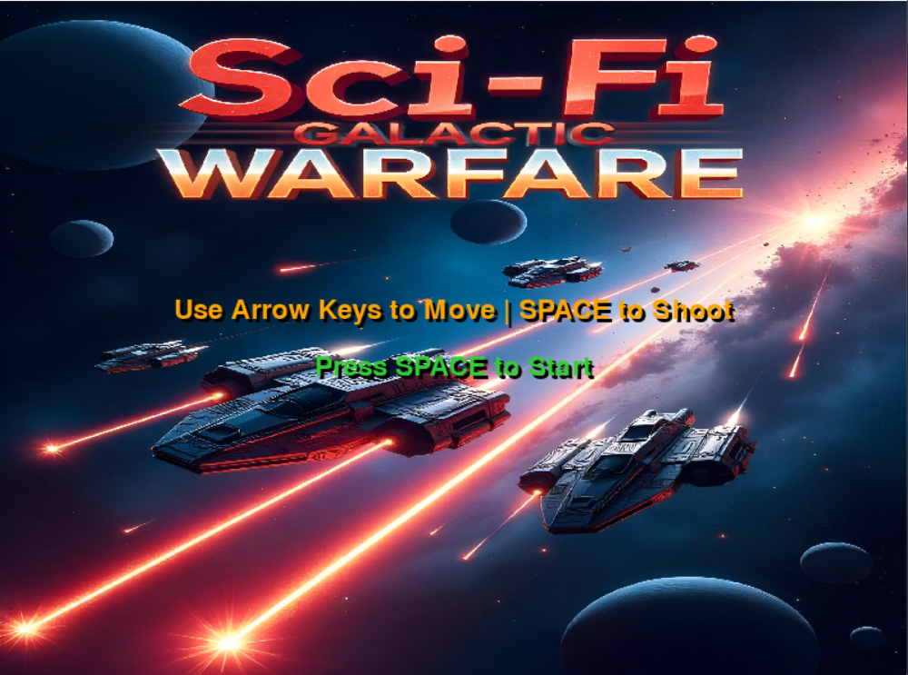
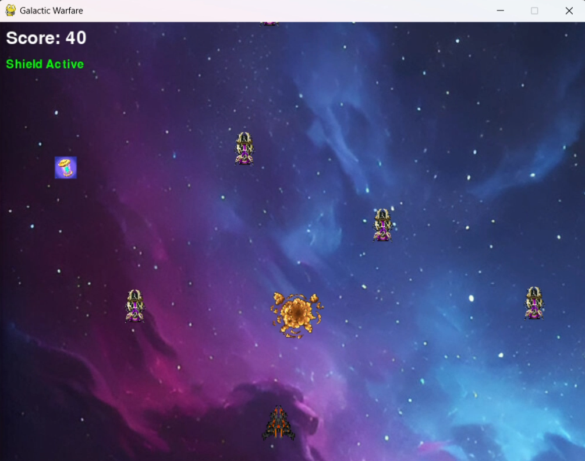
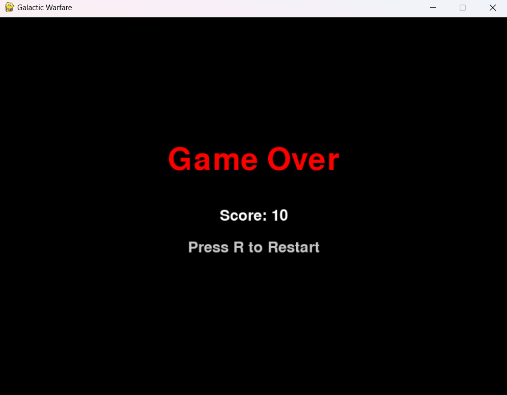

# 🚀 Sci-Fi Galactic Warfare: Interstellar Battle for Survival

## 🎮 Introduction  
**Sci-Fi Galactic Warfare** is a fast-paced 2D space shooter game built using **Python** and **Pygame**. Players command a futuristic spaceship to battle waves of enemies, collect power-ups, and survive explosive galactic warfare. Designed with modular architecture, dynamic AI, and animated visual effects, the game blends arcade-style action with modern gameplay features.

## ✨ Features  
✅ **AI-Driven Enemies** – Intelligent enemies with increasing difficulty and unique behaviors  
✅ **Firing & Explosion Animations** – Frame-based sprite animations for immersive effects  
✅ **Power-Up System** – Shields, triple-shot, and speed boosts for strategic gameplay  
✅ **Scrollable Space Background** – Seamless infinite scrolling for a deep space feel  
✅ **Modular Codebase** – Clean and scalable architecture for easy enhancements  
✅ **Sound Effects** – Integrated audio for shooting, explosions, and upgrades  
✅ **Game States** – Includes Main Menu, Gameplay, and Game Over screens  

## 🧰 Tech Stack  
- **Python 3.10+** – Core language  
- **Pygame** – Game engine and rendering  
- **Custom Assets** – Sprite-based animations and backgrounds  
- **Open Source Tools** – Freesound, OpenGameArt, Kenney assets  

## 📂 Installation  
Clone the repository:
```bash
git clone https://github.com/Kaushik00007/space-shooter-game
cd sci-fi-galactic-warfare
```

Install the required dependencies:
```bash
pip install pygame
```

Run the game:
```bash
python sgw.py
```

## 🔹 Gameplay Instructions  
🎯 Use **arrow keys** to move the spaceship  
💥 Press **SPACE** to shoot  
⚡ Collect power-ups to gain advantages  
💣 Avoid or destroy enemies to survive  
🛡️ Activate shields and use triple shots to dominate  

## 🖼️ Screenshots  
| Main Menu | In-Game | Game Over |
|-----------|---------|------------|
|  |  |  |

## 🛠 Modules  
- **Player Controller** – Movement, shooting, power-up handling  
- **Enemy AI System** – Enemy spawning, behaviors, and difficulty scaling  
- **Collision Detection** – Player-enemy, bullet-enemy, power-up collection  
- **Graphics & Animation** – Backgrounds, effects, sprite rendering  
- **Audio Manager** – Sound for shooting, explosions, and background music  
- **Game Loop & State Manager** – Controls flow between menus, play, and game over  

## 🌟 Future Enhancements  
- Boss Battles & Level Progression  
- Mobile Version 
- In-game shop and achievements  
- Procedural level generation for endless play  
- Online Leaderboards & Player Profiles  
 

## 🙌 Acknowledgments  
Huge thanks to:  
- **Pygame Community**  
- **Kenney.nl**, **OpenGameArt**, **Freesound.org** for assets  

---

